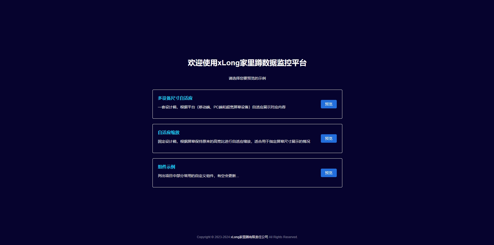
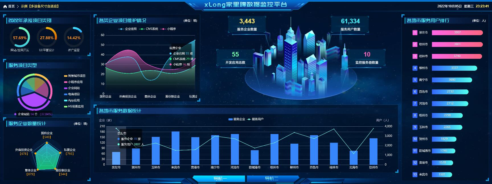
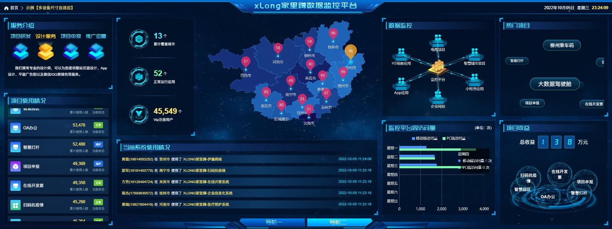
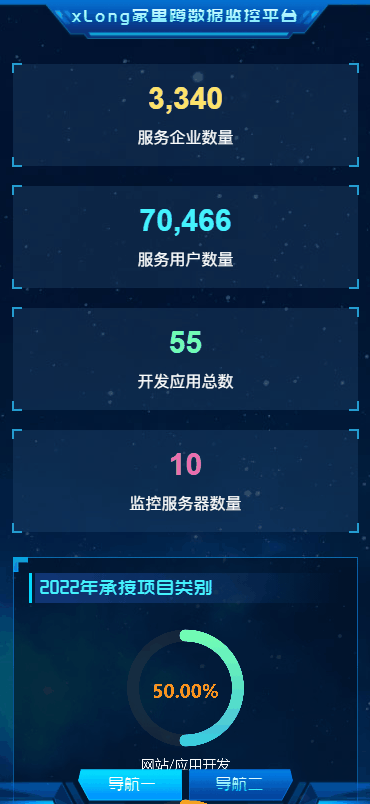
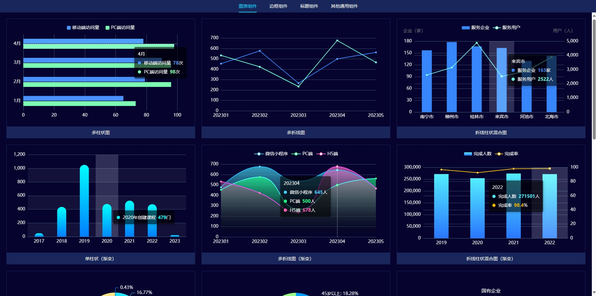
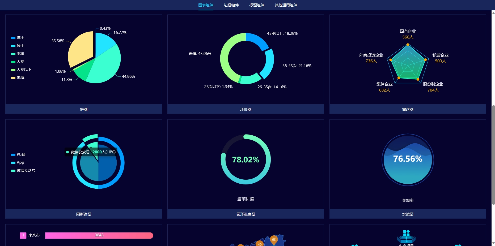
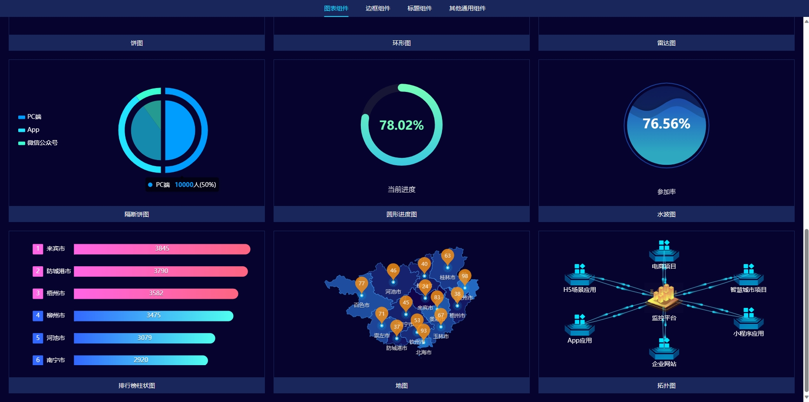
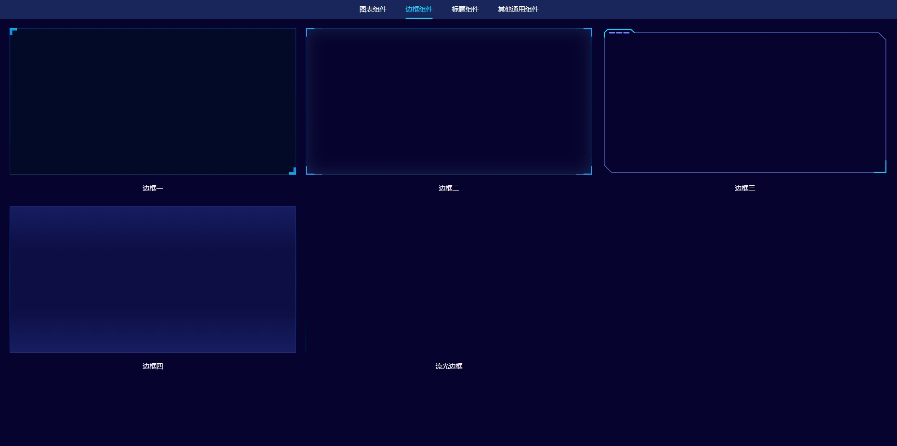
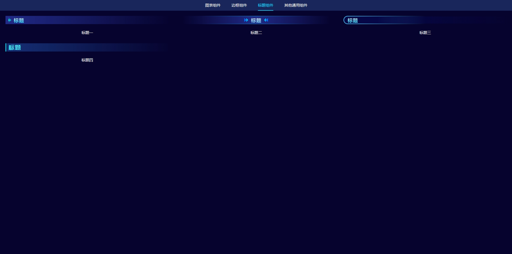
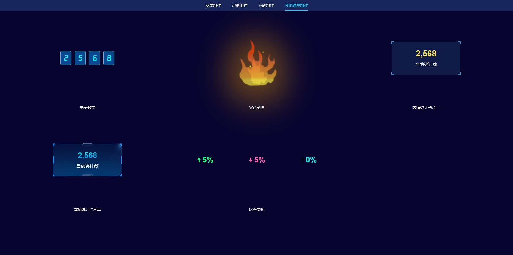

# xlong-big-data

## 重要通知！！！ 
我的账号在Github开启2FA设置后，因某种原因丢失恢复码导致账号无法登录，日后该账号下的所有项目在github不再更新，若想查看持续更新的项目请移步到 [我的码云仓库](https://gitee.com/xlong1029)

## 介绍
xlong-big-data是一个基于 Vite + Vue3 + Element Plus + Pinia + ECharts 开发的单页面客户端渲染的自适应数据监控平台示例，包含2种预览模式。
 
#### 1. 多设备尺寸自适应  
一套设计稿，根据平台（移动端、PC端和超宽屏幕设备）自适应展示对应内容
#### 2. 自适应缩放  
固定设计稿，根据屏幕保持原来的高宽比进行自适应缩放，适合用于指定屏幕尺寸展示的情况

* 该项目仅作学习参考，请勿商用

## 项目展示

> DEMO地址：https://xlong1029.github.io/xlong-big-data/

## 更新说明

#### 1. 2023-12-04
    新增图表、标题、边框等组件示例

## 项目说明

#### 1. 前后端分离开发模式

- **前端**：Vite + Vue3
- **后端**：Mock.js模拟请求

#### 2. 项目用到技术、框架与插件

[Vue3](https://v3.vuejs.org)<br/>
[Vite](https://cn.vitejs.dev)<br/>
[Pinia](https://github.com/vuejs/pinia)<br/>
[Mockjs](http://mockjs.com)<br/>
[Element Plus](https://github.com/element-plus)<br/>
[ECharts](https://echarts.apache.org)<br/>
[Swiper](https://www.swiper.com.cn)<br/>
[vue3-seamless-scroll](https://github.com/xfy520/vue3-seamless-scroll)<br/>

## 部分项目运行截图

gif文件稍微有点大，被压缩了，丢失了部分色彩：<br/>



* PC界面


* 宽屏界面





* 移动端界面




* 自适应展示


* 组件示例













## 目录结构

```
│  .env.development // 开发环境配置
│  .env.production // 生产环境配置
│  .env.release // release环境配置
│  .gitignore
│  package.json
│  vite.config.js // 配置文件
│  README.md
│  index.html // 入口文件
│
├─pubilc
│   favicon.ico // 图标
│
├─src
│  │  main.js // 项目入口js
│  │  permission.js // 路由权限
│  │  components.js // 全局注册组件
│  │  element-plus.js // element plus配置
│  │  settings.js // 设置文件
│  │  App.vue // 根组件
│  │
│  ├─assets // 资源目录，这里的资源会被wabpack构建
│  ├─api // api接口文件
│  ├─styles  // 样式
│  │
│  ├─store  // 应用级数据（state）
│  │  │  index.js
│  │  │
│  │  └─modules
│  │
│  ├─hooks 钩子函数
│  │  │  index.js
│  │  │
│  │  └─modules
│  │
│  ├─mock // 模拟请求数据
│  │  │  index.js
│  │  │  mock-handle.js // 数据处理
│  │  │  mock-server.js // 正式环境使用配置
│  │  │
│  │  └─modules
│  │
│  ├─components // 组件
│  │  │
│  │  ├─common // 通用组件
│  │  │
│  │  ├─screen // 大屏组件
│  │  │
│  │  └─charts // 图表组件
│  │
│  ├─directives // 自定义指令
│  │  │  index.js
│  │  │  utils.js // 工具
│  │  │
│  │  └─modules
│  │
│  ├─views // 视图
│  │  │
│  │  ├─home // 首页
│  │  ├─adpt-multi-device // 多设备自适应示例
│  │  ├─adpt-scale // 自适应缩放示例
│  │  └─test // 保留的测试页面
│  │
│  ├─utils // 通用工具函数
│  │    index.js
│  │    auth.js // 读写token
│  │    calendar.js // 日历
│  │    request.js // 请求配置
│  │
│  └─router  // 路由配置
│     │  index.js
│     │
│     └─modules // 分模块的动态路由
│
└─static // 静态资源
```

## 本地运行
1. 安装依赖
> npm install
2. 运行项目
> npm run dev
3. 访问地址：http://localhost:8686

## 作者联系方式

QQ：381612175
TEL: 18376686974

github：https://github.com/xLong1029/

站酷主页：http://xlong.zcool.com.cn/

UI 中国：http://i.ui.cn/ucenter/358591.html
